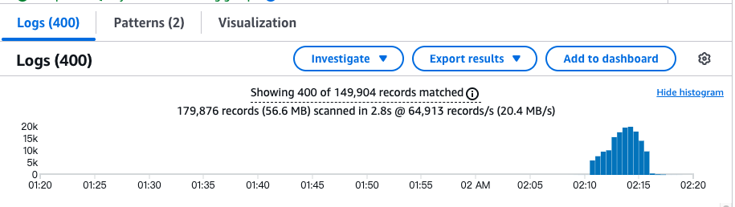
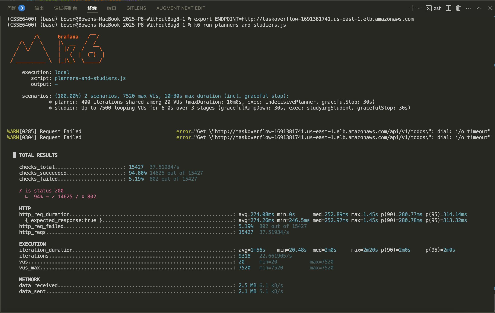

## 这是Week10的代码说明

### 这周的主要内容是

交给我们一种debug的方法，可以帮助我们判断项目出现的问题，通过cloudwatch来检测
### 代码笔记/备注

#### 1. python里面的class类的用法

```python
# 1. 这里声明了一个StructuredFormatter类，括号里是继承的意思，继承了 watchtower.CloudWatchLogFormatter，所以它有父类的方法
class StructuredFormatter(watchtower.CloudWatchLogFormatter):
    def format(self, record):
        # 具体怎么格式化日志

# 2. 创建对象，要调用该类需要实例化对象
formatter = StructuredFormatter()

# 3. 使用对象，调用方法
some_log_text = formatter.format(record)
```

#### 2. 日志具体的使用方法

```python
'''
  1. 首先导入必要的库 
    •	logging 是Python标准库，专门做日志的。
    •	watchtower 是AWS CloudWatch的日志Handler。
    •	has_request_context / request 用来判断有没有HTTP请求，能拿到请求信息。
    •	uuid 是用来生成唯一的请求ID（Correlation ID）的。
'''
import watchtower, logging
from flask import has_request_context, request
import uuid

'''
  2. 定义了一个class，用于将日志格式化输出(JSON)
'''
class StructuredFormatter(watchtower.CloudWatchLogFormatter):
    def format(self, record):
        record.msg = {
            'timestamp': record.created,
            'location': record.name,
            'message': record.msg,
        }
        if has_request_context():
            record.msg['request_id'] = request.environ.get('REQUEST_ID')
            record.msg['url'] = request.environ.get('PATH_INFO')
            record.msg['method'] = request.environ.get('REQUEST_METHOD')
        return super().format(record)

'''
  3. 创建Flask应用
'''
app = Flask(__name__, static_folder='app', static_url_path="/")

'''
  4. 创建CloudWatch的日志Handler
    •	watchtower.CloudWatchLogHandler ➔ 转发日志到AWS CloudWatch的通道。
    •	log_group_name="taskoverflow" ➔ 指定CloudWatch里分组名字叫”taskoverflow”。
    •	boto3.client(...) ➔ 连接AWS CloudWatch的Python客户端。
    •	setFormatter(StructuredFormatter()) ➔ 告诉Handler：日志先用你自己定义的StructuredFormatter格式化一下！
    
    Handler的作用就是：
    •	接收Logger广播出来的话，
    •	决定往哪里送，
    •	以及怎么送（比如，是原样发？还是先加工一下？比如加上时间戳？）
	
'''
handler = watchtower.CloudWatchLogHandler(
    log_group_name="taskoverflow",
    boto3_client=boto3.client("logs", region_name="us-east-1")
)
handler.setFormatter(StructuredFormatter())

'''
  5. 把这个Handler挂到日志系统中
  Logger的作用是：
	•	把这些信息（比如“有人访问了！”、“数据库查询了！”）收集起来，
	•	然后准备广播出去（但自己不会直接发送）。
'''

app.logger.addHandler(handler)  # Flask应用自己的日志用这个Handler发送
logging.getLogger().addHandler(handler) # 根日志器（默认日志）
logging.getLogger('werkzeug').addHandler(handler) # 让Flask的底层服务器Werkzeug的日志也发到CloudWatch
logging.getLogger("sqlalchemy.engine").addHandler(handler) # 让SQLAlchemy执行数据库查询的日志也发过去
logging.getLogger("sqlalchemy.engine").setLevel(logging.INFO) #设置SQLAlchemy日志只收INFO级别及以上

'''
6. 每个HTTP请求的前后，打印日志
	•	每次HTTP请求到来之前：
		•	生成一个唯一的请求ID（用uuid）。
		•	放到request.environ里。
	•	每次HTTP请求结束之后：
		•	再打一次日志，标记请求结束。
'''
@app.before_request
def before_request():
    request.environ['REQUEST_ID'] = str(uuid.uuid4())
    app.logger.info("Request started")

@app.after_request
def after_request(response):
    app.logger.info("Request finished")
    return response
```

#### 3. ⚠️注意事项

- 记得给`/app/bin/docker-entrypoint.sh`这个文件授予权限`chmod + x`，否则ECS运行不起来,一直报错

  ```bash
  # 查询文件是否有权限，正确的话应该为-rwxr-xr-x
  ls -l bin/docker-entrypoint.sh
  ```

- 记得修改k6文件中的

  ```javascript
  // 她这句话写错了，改成底下的这个就对了
  request = http.del(`${url}/${wrongId}`);
  ```

- 修改`__init__.py`文件里的这两个代码，写错了

  ```python
  logger = logging.getLogger('request')
     logger.addHandler(handler)
  
     @app.before_request
     def before_request():
        request.environ['REQUEST_ID'] = str(uuid.uuid4())
        logger.info("Request started")
  
     @app.after_request
     def after_request(response):
        logger.info("Request finished")
        return response
  
  # 文档里用的不对，会报错
  requests = logging.getLogger("requests")
  requests.addHandler(handler)
  ```

  

- 临时地址`export ENDPOINT=http://taskoverflow-1691381741.us-east-1.elb.amazonaws.com`

- 本地开发测试使用`Dockerfile.dev`（开启更多debug mode（比如Flask debug模式）），正式开发部署使用`Dockerfile`

- 注意每次执行`docker compose up`的时候,**由于有些文件不会没有修改的话，只是想授予权限**——Docker默认会用老的缓存层，跳过COPY和RUN这些步骤，**没有清除旧的缓存**，所以会失败；因此请先执行`docker compose build --no-cache`重新build一遍

- 镜像构建的时候记得要改成`--platform=linux/amd64`格式的

运行成功截图




